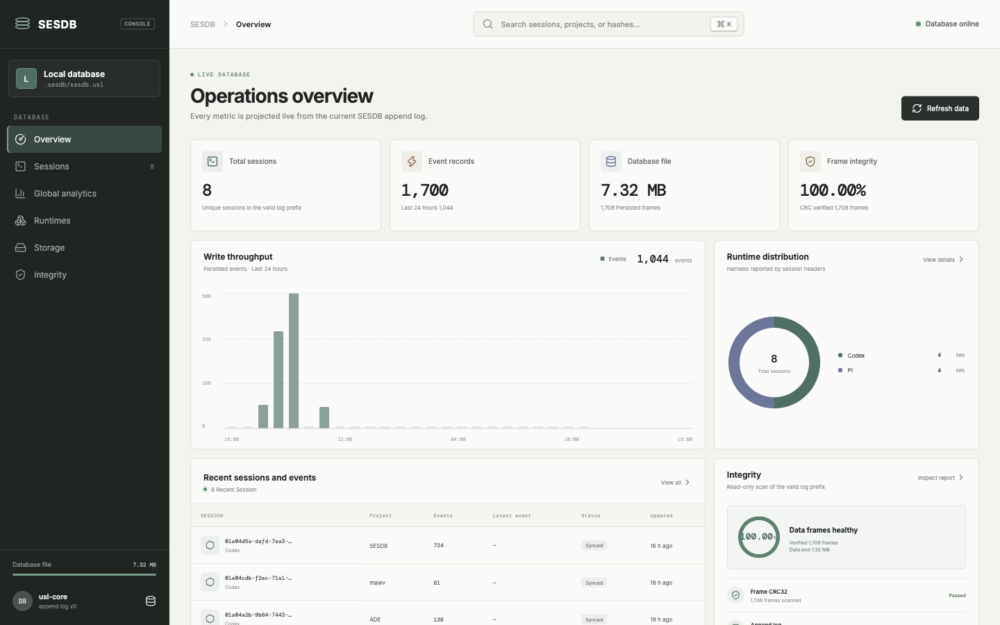
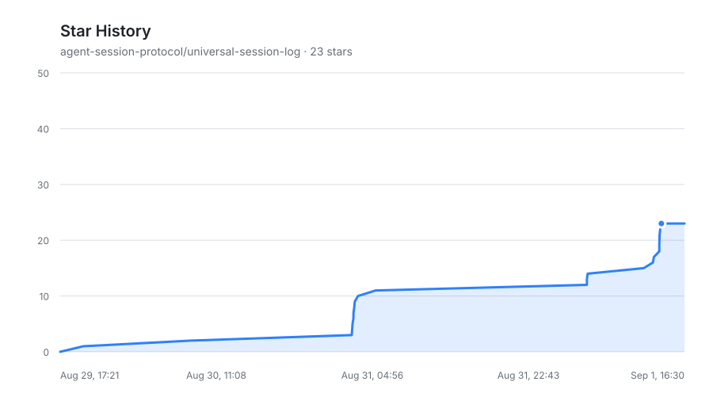

# USL — Universal Session Log

> **USL is the storage-first reference implementation of the [Agent Session Protocol (ASP)](https://github.com/agent-session-protocol/asp).** ACP handles the live present (editor↔agent interaction); ASP handles the durable past and cross-runtime migration; **USL is the storage engine behind ASP.**
>
> [English](README.md) · [中文](README.zh-CN.md)

USL answers one question: **how to collect the session logs of any agent runtime (pi / Claude Code / Codex / opencode / dimagent) into a unified, recoverable, inter-convertible storage layer** — making resume / fork / handoff (cross-harness continuation) and unified history rendering possible.

## SesDB Console

Browse sessions and native events, compare runtime usage, and inspect storage and integrity from one management console. The hosted interactive demo uses safe sample data and requires no setup.

[Open the interactive demo](https://agent-session-protocol.github.io/universal-session-log/console?lang=en)

[](https://agent-session-protocol.github.io/universal-session-log/console?lang=en)

## Three core properties

1. **Storage-first; correctness comes from the append log alone.** Every record carries a length prefix + CRC; recovery scans frames and truncates at the first torn frame. Recovered state is byte-deterministic (no WAL/checkpoint/header dependency).
2. **Opaque payloads are first-class.** Bytes that can't be parsed but must round-trip (Claude's thinking `signature`, Codex's `encrypted_content`) are carried in a typed `unknown` block — never dropped in conversion.
3. **Round-trip fidelity comes from the evidence layer.** Cross-harness conversion (pi/dimagent/claude/codex) replays the importer's native payloads verbatim, declaring loss only when synthesizing.

## Repository layout

```
crates/
├── usl-core/       # Rust storage engine: append-only, crash-recoverable, schema-agnostic
├── usl-capture/    # Rust capture layer: file-boundary live ingest + framing + conversion
├── sesdb-engine/   # Compatible stdio engine + single-writer sesdbd/FTS5/provider service
└── usl-fuse/       # Rust FUSE mount layer (paused: no usable FUSE on macOS 26)
packages/
├── usl-convert/    # TS cross-harness conversion layer (ASP reference)
└── sesdb/          # Alpha daemon/stdio SDK, CLI, and minimal local Console
docs/
├── research/       # research background (ASP/ACP/FUSE analyses)
└── architecture/   # architecture wiki (verifiable source provenance)
```

## Quick start

```bash
# Rust storage + capture (54 tests)
cargo test --workspace

# TS cross-harness conversion (25 tests)
cd packages/usl-convert && npm install && npm run check

# SesDB alpha SDK/query foundation (build sesdb-engine first)
cargo build -p sesdb-engine
cd packages/sesdb && npm install && npm run check

# architecture wiki verification (source provenance / hash / coverage)
npm run lint:architecture

# pinned Obelisk comparison contract (honest delivered/specified/planned ledger)
npm run lint:baseline
```

The product-completeness comparison is frozen at
`tommy0103/obelisk@f256668`. See
[`docs/research/2026-09-obelisk-vs-sesdb.md`](docs/research/2026-09-obelisk-vs-sesdb.md)
for the clean-room boundary and current parity status. The I0 benchmark gate is
still in progress. The v0.2 slice covers only Claude/Codex incremental indexing
and literal FTS5; the other providers, memory, and desktop remain roadmap work.
The staged release gates and acceptance checklist are tracked in the
[`SESDB delivery roadmap`](docs/research/2026-09-sesdb-delivery-roadmap.md).

## Protocol spec

This repository contains only the implementation; the protocol layer (canonical schema, event semantics, fidelity matrix, opaque-passthrough conventions) lives in the [ASP spec](https://github.com/agent-session-protocol/asp).

## Status

**Validation stage**: storage engine 32 tests, capture 21 tests, conversion 25 tests — all green; real-data smoke — a Codex session (303 messages / 91 tools / 99 encrypted-reasoning blobs) round-trips through pi with zero loss.

## Star History


